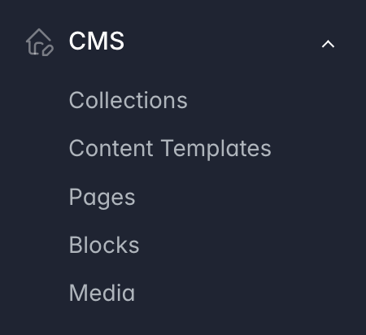

---
layout:
  title:
    visible: true
  description:
    visible: false
  tableOfContents:
    visible: true
  outline:
    visible: true
  pagination:
    visible: true
---

# Features Overview

The **Sylius CMS Plugin** adds a powerful Content Management System to your Sylius store. It allows you to create, manage, and publish dynamic content directly from the Sylius Admin Panel—no development needed.

<figure><figcaption></figcaption></figure>

## Key Features in the Admin Panel

* [**Collections**](collections.md)\
  Group related content elements, such as pages, blocks, and media, into reusable containers. Perfect for organizing content by themes or sections.
* [**Content Templates**](content-templates.md)\
  Create predefined structures (templates) for pages or blocks. Speed up content creation and ensure consistency across your site.
* [**Pages**](pages.md)\
  Build complete pages for your storefront, like home pages, blog posts, and informational sections. Fully customizable and easy to organize.
* [**Blocks**](blocks.md)\
  Design modular content pieces such as headers, banners, or text areas. Easily insert them into pages or reuse them in templates.
* [**Media**](media.md)\
  Centralized media library for managing images, videos, and downloadable files. Use assets across pages, blocks, and templates.
