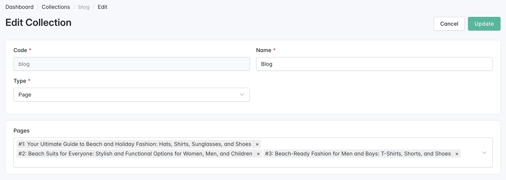

# Collections

The **Collections** feature in the Sylius CMS Plugin allows administrators to group and manage related content, such as CMS pages, blocks, or media, into named containers. This provides a flexible, reusable structure for building consistent layouts and managing content across your storefront.

## Why Use Collections?

* **Organize Content**\
  Group similar content elements—like blog posts, product highlights, or promotional banners—into a single logical unit.
* **Maintain Layout Consistency**\
  Apply the same set of content blocks, media, or pages across multiple areas of your site, ensuring a cohesive design and message.
* **Improve Flexibility**\
  Rearrange or update grouped items in one place without modifying each individual page.

## Key Concepts

* **Container**\
  A collection acts as a wrapper that contains blocks, pages, or media.
* **Presentation**\
  Controls how grouped content is rendered and positioned in the storefront.
* **Customization**\
  Ideal for tailoring layouts for specific campaigns, product categories, or user segments.

<figure><figcaption></figcaption></figure>

## Creating a Collection

1. **Open the Sylius Admin Panel**
2. **Navigate to**: `CMS → Collections`
3. **Click**: `Create`
4. **Fill in the Form**:
   * **Code**: A unique system identifier (e.g., `home_banner_set`)
   * **Name**: A readable label shown in the admin panel
   * **Type**: Choose whether the collection will include:
     * `Pages`
     * `Blocks`
     * `Media`
   * **Content Field**:\
     Depending on the selected type, a dynamic autocomplete field appears (`Pages`, `Blocks`, or `Media`). Select one or more content items to include in this collection.
5. **Submit the Form**

## Accessing a Collection on the Storefront

Once created, the collection becomes accessible at:

```bash
{your-store-hostname}/{locale}/collections/{collection-code}/pages
```

Example:\
`https://example.com/en_US/collections/homepage-banners/pages`

