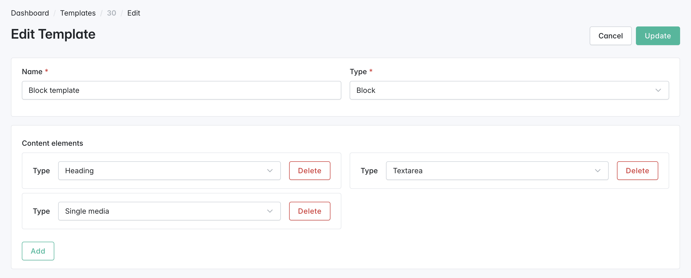

# Content Templates

**Content Templates** allow you to define reusable layout structures—called _skeletons_—for pages and blocks. These templates help you assemble content faster, maintain consistent design across your store, and update layouts in one place.

## What Can a Content Template Include?

You can mix and match the following **content elements (widgets)** when building a template:

* **Single Media**
* **Multiple Media**
* **Products Carousel by Taxon**
* **Products Grid by Taxon**
* **Pages Collection**
* **Textarea**
* **Heading**
* **Products Carousel**
* **Products Grid**
* **Taxons List**
* **Spacer**

## Why Use Content Templates?

* **Consistency**\
  Standardize the structure and design of your pages and blocks.
* **Efficiency**\
  Define layouts once and reuse them, reducing repetitive work.
* **Flexibility**\
  Update the structure centrally—changes are reflected across all content using the template.

## How to Create a Content Template

1. **Open the Sylius Admin Panel**
2. **Navigate to**: `CMS → Content Templates`
3. **Click**: `Create New Content Template`
4. **Fill in the Template Details**:
   * **Name**: A descriptive label (e.g., `Product Feature Section`)
   * **Type**: Select whether the template will be used for:
     * `Page`
     * `Block`
   * **Add Content Elements**:\
     Select from the available widgets and arrange them in the desired order.
5. **Save** the template.

You can create as many templates as needed to support different content types or marketing goals.

<figure><figcaption></figcaption></figure>

## Using a Content Template in a Page or Block

1. **Open** the page or block editor.
2. **Locate** the **Content Template** field.
3. **Start Typing** the template name.\
   An autocomplete dropdown will appear.
4. **Select** the template and click **Add**.

> ⚠️ **Important:**\
> Inserting a content template will _replace_ any existing content configuration for the current locale.

5. **Fill In** the fields defined by the template (e.g., media, text, taxon selections).
6. **Publish** your page or block as usual.
