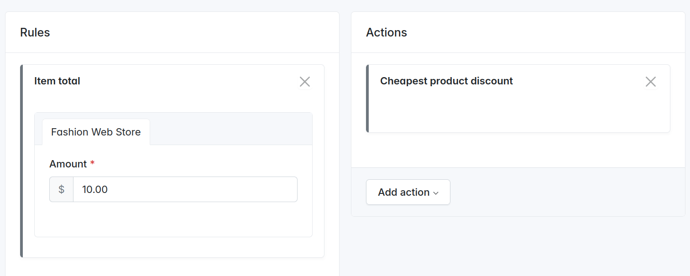

---
layout:
  title:
    visible: true
  description:
    visible: false
  tableOfContents:
    visible: true
  outline:
    visible: true
  pagination:
    visible: true
---

# How to add a custom cart promotion action?

In real-world shops, it's common to need custom cart promotions that go beyond the default options provided by Sylius. For example, you might want to apply a **100% discount to the cheapest item in the cart**.

To achieve this, Sylius allows you to create a custom `PromotionAction`. This action defines the logic of how a discount or other incentive should be applied to an order. In this guide, you’ll implement a custom action that identifies the cheapest item in the cart and applies a full discount to it.

This approach gives you full control over how promotions behave in your store and can be easily reused across multiple promotions from the Admin panel.

***

### &#x20;1. Create a Custom Promotion Action

Create a new class `CheapestProductDiscountPromotionActionCommand` in `src/Promotion/Action`:

```php
<?php

// src/Promotion/Action/CheapestProductDiscountPromotionActionCommand.php

declare(strict_types=1);

namespace App\Promotion\Action;

use Sylius\Component\Core\Distributor\ProportionalIntegerDistributorInterface;
use Sylius\Component\Core\Model\OrderItemInterface;
use Sylius\Component\Core\Promotion\Action\DiscountPromotionActionCommand;
use Sylius\Component\Core\Model\OrderInterface;
use Sylius\Component\Core\Promotion\Applicator\UnitsPromotionAdjustmentsApplicatorInterface;
use Sylius\Component\Promotion\Model\PromotionInterface;
use Sylius\Component\Promotion\Model\PromotionSubjectInterface;
use Symfony\Component\DependencyInjection\Attribute\Autowire;
use Webmozart\Assert\Assert;

final class CheapestProductDiscountPromotionActionCommand extends DiscountPromotionActionCommand
{
    public const TYPE = 'cheapest_item_discount';

    public function __construct(
        private readonly ProportionalIntegerDistributorInterface $proportionalDistributor,
        private readonly UnitsPromotionAdjustmentsApplicatorInterface $unitsPromotionAdjustmentsApplicator,
    ) {
    }

    public function execute(PromotionSubjectInterface $subject, array $configuration, PromotionInterface $promotion): bool
    {
        /** @var OrderInterface $subject */
        Assert::isInstanceOf($subject, OrderInterface::class);

        if (!$this->isSubjectValid($subject)) {
            return false;
        }

        try {
            $this->isConfigurationValid($configuration);
        } catch (\InvalidArgumentException) {
            return false;
        }

        $cheapestItem = $this->findCheapestItem($subject);
        $discountAmount = -1 * $cheapestItem->getUnitPrice();

        if (0 === $discountAmount) {
            return false;
        }

        $itemsTotals = $this->getItemsTotals($subject);
        $splitPromotion = $this->proportionalDistributor->distribute($itemsTotals, $discountAmount);

        $this->unitsPromotionAdjustmentsApplicator->apply($subject, $promotion, $splitPromotion);

        return true;
    }

    protected function isConfigurationValid(array $configuration): void
    {
        Assert::true(true);
    }

    private function findCheapestItem(OrderInterface $order): OrderItemInterface
    {
        $cheapestItem = $order->getItems()->first();

        foreach ($order->getItems() as $item) {
            if ($item->getUnitPrice() < $cheapestItem->getUnitPrice()) {
                $cheapestItem = $item;
            }
        }

        return $cheapestItem;
    }

    private function getItemsTotals(OrderInterface $order): array
    {
        $itemsTotals = [];

        foreach ($order->getItems() as $item) {
            $itemsTotals[] = $item->getTotal();
        }

        return $itemsTotals;
    }
}
```

***

### 2. Define the Configuration Form Type

Create a new form type class `CheapestProductDiscountConfigurationType`:

```php
<?php

// src/Form/Type/Action/CheapestProductDiscountConfigurationType.php

namespace App\Form\Type\Action;

use Symfony\Component\Form\AbstractType;

final class CheapestProductDiscountConfigurationType extends AbstractType
{
    public function getBlockPrefix(): string
    {
        return 'app_promotion_action_cheapest_product_discount_configuration';
    }
}
```

***

### 3. Register Services

Update `config/services.yaml`:

```yaml
services:
    App\Promotion\Action\CheapestProductDiscountPromotionActionCommand:
        tags:
            - {
                name: sylius.promotion_action,
                type: cheapest_item_discount,
                form_type: App\Form\Type\Action\CheapestProductDiscountConfigurationType,
                label: 'Cheapest product discount'
              }
```


If your autowiring is disabled, you will need also to register your `CheapestProductDiscountConfigurationType` along with the constructor arguments of `CheapestProductDiscountPromotionActionCommand` in `config/services.yaml`:

```yaml
services:    
    App\Form\Type\Action\CheapestProductDiscountConfigurationType:
        tags: [form.type]
    
    App\Promotion\Action\CheapestProductDiscountPromotionActionCommand:
        arguments:
            - '@sylius.distributor.proportional_integer'
            - '@sylius.applicator.promotion.units_adjustments'
        tags:
            - {
                name: sylius.promotion_action,
                type: cheapest_item_discount,
                form_type: App\Form\Type\Action\CheapestProductDiscountConfigurationType,
                label: 'Cheapest product discount'
              }
```


***

### ✅ Result

Go to your Sylius admin panel at `/admin/promotions/new`. While configuring a promotion, you should now see your new **"Cheapest product discount"** action available in the list.

<figure><figcaption></figcaption></figure>

This configuration above ensures that when a customer's cart total reaches **$10 or more**, the **cheapest product in the order** will be discounted.

<figure><figcaption></figcaption></figure>

***


To explore more examples of available promotion actions and how they are implemented, click [here](https://github.com/Sylius/Sylius/tree/v2.0.7/src/Sylius/Component/Core/Promotion/Action)!

