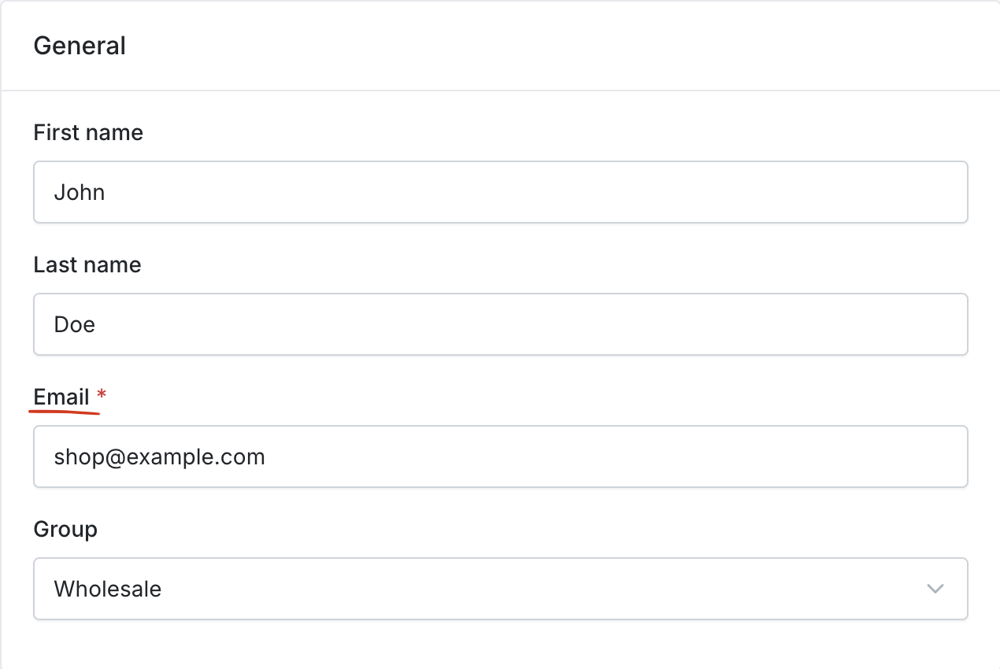
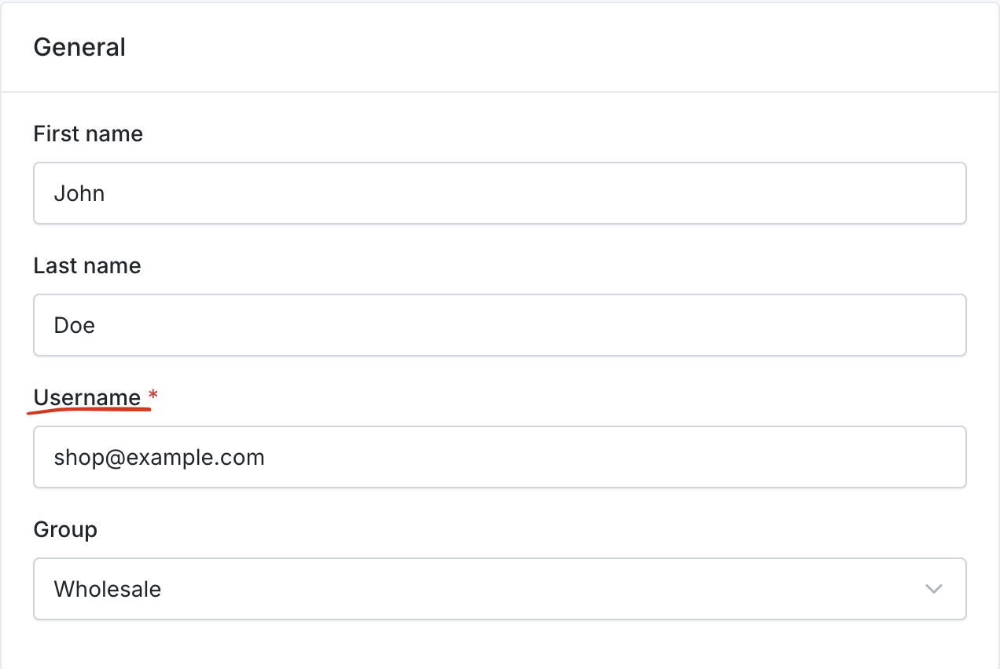

---
layout:
  title:
    visible: true
  description:
    visible: false
  tableOfContents:
    visible: true
  outline:
    visible: true
  pagination:
    visible: true
---

# Customizing Translations

Translations in Sylius can be easily customized to match your business needs better. Whether you want to adjust wording for clarity, branding, or localization, you can override default translations in your project.

### Why Customize Translations?

You might want to modify translations if you need to:\
✅ Change default labels, such as **"Last name" → "Surname"**.\
✅ Adjust button text, like **"Add to cart" → "Buy"**.\
✅ Localize content to better suit your target audience.

### How to Customize Translations

#### **Step 1: Create a Translation File**

If you haven’t already, create a **translations/messages.en.yaml** file for English translations.

📌 **For other languages**, create separate files, such as:

* **Polish** → `translations/messages.pl.yaml`
* **French** → `translations/messages.fr.yaml`

**Step 2: Find the Correct Translation Key**

If you're unsure which key to override, **use the Symfony Profiler**:

1. Open the page where you want to change a translation.
2. Click the **Translations** icon in the Symfony Profiler.
3. Find the **message key** associated with the text you want to modify.

**Example:** Changing **"Email"** to **"Username"** on the login form.

```yaml
sylius:
    form:
        customer:
            email: Username
```

**Before/After:**

<div><figure><figcaption><p>Before</p></figcaption></figure> <figure><figcaption><p>After</p></figcaption></figure></div>

To apply your changes, clear the cache:

```bash
php bin/console cache:clear
```

### Good to Know

✅ You can override translations **directly in your application** or **in a Sylius plugin**.\
✅ Different languages should be stored in separate translation files.\
✅ The **Symfony Profiler** is a great tool for identifying translation keys.

With these simple steps, you can customize Sylius translations to better fit your project! 🚀
